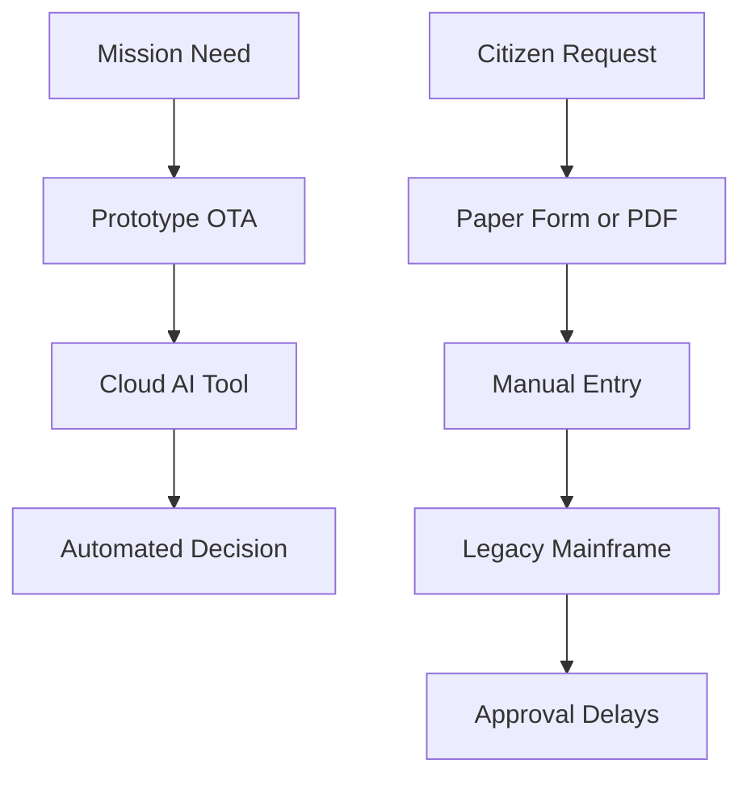
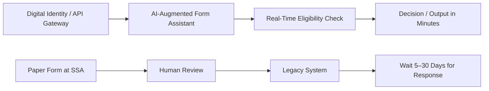

# 🛰️ Case Study: DoD vs. HHS – Digital Workflow Modernization

**Why the Department of Defense Runs on AI While the DMV Still Runs on Paper**

---

## 🧠 Overview

This case study compares the digital workflows of the **Department of Defense (DoD)** with the **Department of Health and Human Services (HHS)** — and outlines how their practices could be adapted to modernize everyday services like the **Social Security Office** and **Department of Transportation (DMV)**.

We examine:

* Mission-driven vs. citizen-driven technology use
* AI, cloud, and low-code adoption
* What slows down civilian agencies
* How we can modernize front-facing services with DoD-inspired agility

---

## 🛰️ Section 1: DoD Digital Workflow Strategy

| Feature         | Department of Defense (DoD) Implementation                               |
| --------------- | ------------------------------------------------------------------------ |
| **Cloud**       | AWS GovCloud, Azure IL5, classified Kubernetes clusters                  |
| **AI/ML**       | Computer vision for drones, predictive maintenance, battlefield modeling |
| **Contracting** | OTAs (Other Transaction Agreements) used for rapid tech adoption         |
| **Culture**     | Experimentation-first, mission-focused, "fail fast" innovation cycles    |
| **Outcome**     | Rapid tech deployment, automated decisions, reduced human intervention   |

---

## 🏛️ Section 2: HHS and Civilian Agency Challenges

| Feature         | HHS / SSA / DMV Reality                                                |
| --------------- | ---------------------------------------------------------------------- |
| **Tech Stack**  | COBOL, .NET 2.0, Oracle 11g still in production                        |
| **AI/ML**       | Pilot projects in fraud detection, limited NLP for form automation     |
| **Contracting** | Waterfall contracting cycles under FAR, often 3–5 years per update     |
| **Culture**     | Risk-averse, compliance-centric, low tolerance for experimentation     |
| **Outcome**     | Outdated UIs, long queues, PDF-based forms, multi-day turnaround times |

---

## 🧭 Visual Workflow Comparison



---

## 🧰 Section 3: What Slows Down Social Security and DMV Offices

* Fragmented data (identity, eligibility, address not unified)
* No API-first or citizen-ID layer for services
* Manual paperwork + outdated mainframes
* Federal procurement delays
* Lack of performance incentives for real-time service improvement

---

## 🧠 Section 4: What Could Be Done (DoD-Inspired Solutions)

| Fix                          | DoD Model Equivalent                               |
| ---------------------------- | -------------------------------------------------- |
| Pre-cleared SaaS platforms   | FedRAMP-approved tools like Retool, Okta, GitHub   |
| Civic tech OTAs              | Like DIU / AFWERX rapid vendor pipelines           |
| AI Copilot for forms         | Turn static PDFs into GPT-augmented input flows    |
| Cloud-native queue analytics | Like DoD command dashboards with real-time metrics |
| Cross-agency "Digital Units" | Agile teams modeled after military readiness units |

---

## 📈 Visual: Fast vs. Slow Service Evolution



---

## 📊 Advanced Visualizations

### 1. DoD AI Adoption vs HHS Modernization vs SSA Wait Times (2014–2024)

```r
library(tidyverse)
library(scales)

df <- tibble(
  year = 2014:2024,
  DoD_AI = c(10, 15, 22, 30, 40, 52, 65, 75, 82, 88, 91),
  HHS_Digital = c(5, 6, 8, 10, 14, 18, 21, 25, 30, 34, 38),
  SSA_Wait_Days = c(32, 30, 28, 27, 25, 22, 20, 18, 17, 15, 14)
)

p <- ggplot(df, aes(x = year)) +
  geom_line(aes(y = DoD_AI), color = "#FFA500", size = 1.8) +
  geom_line(aes(y = HHS_Digital), color = "#FF4500", size = 1.4, linetype = "dashed") +
  geom_bar(aes(y = SSA_Wait_Days * 2), stat = "identity", fill = "#DC143C", alpha = 0.5) +
  scale_y_continuous(
    name = "DoD AI Adoption / HHS Digital Services (%)",
    sec.axis = sec_axis(~./2, name = "SSA Wait Time (Days)")
  ) +
  labs(
    title = "AI Modernization: DoD vs HHS vs SSA (2014–2024)",
    subtitle = "Source: GAO, DoD CIO Office, SSA Inspector General Reports, FedScoop (2014–2024)",
    x = "Year"
  ) +
  theme_minimal(base_family = "sans") +
  theme(
    plot.background = element_rect(fill = "black"),
    panel.background = element_rect(fill = "black"),
    panel.grid.major = element_line(color = "white", size = 0.3),
    panel.grid.minor = element_blank(),
    axis.title = element_text(color = "white"),
    axis.text = element_text(color = "white"),
    plot.title = element_text(color = "white", face = "bold", size = 14),
    plot.subtitle = element_text(color = "white", size = 9)
  )
print(p)
```

### 2. Civilian Digital Budgets vs DoD AI Investment (2014–2024)

```r
library(tidyverse)
library(scales)

df <- tibble(
  year = 2014:2024,
  HHS_IT = c(2.8, 3.2, 3.5, 4.0, 4.6, 5.1, 5.9, 6.4, 6.9, 7.2, 7.5),
  SSA_IT = c(1.2, 1.3, 1.4, 1.4, 1.6, 1.9, 2.0, 2.2, 2.3, 2.4, 2.5),
  DOT_IT = c(0.9, 1.0, 1.1, 1.3, 1.6, 1.9, 2.0, 2.1, 2.3, 2.5, 2.7),
  DoD_AI = c(0.7, 0.9, 1.2, 1.8, 2.3, 3.0, 3.8, 4.7, 5.3, 6.1, 6.8)
)

long <- df %>%
  pivot_longer(cols = c(HHS_IT, SSA_IT, DOT_IT), names_to = "agency", values_to = "budget")

p <- ggplot() +
  geom_bar(data = long, aes(x = year, y = budget, fill = agency),
           stat = "identity", position = "stack", alpha = 0.8) +
  geom_line(data = df, aes(x = year, y = DoD_AI),
            color = "#FF4500", size = 2) +
  scale_fill_manual(values = c("HHS_IT" = "#FFA500", "SSA_IT" = "#B0B0B0", "DOT_IT" = "#808080")) +
  labs(
    title = "Civilian Digital Budgets vs DoD AI Investment (2014–2024)",
    subtitle = "Source: GAO, Congressional Budget Office, DoD AI Strategy (2018–2024)",
    x = "Year",
    y = "Budget (Billions USD)"
  ) +
  theme_minimal(base_family = "sans") +
  theme(
    plot.background = element_rect(fill = "black"),
    panel.background = element_rect(fill = "black"),
    panel.grid.major = element_line(color = "white", size = 0.3),
    panel.grid.minor = element_blank(),
    axis.title = element_text(color = "white"),
    axis.text = element_text(color = "white"),
    plot.title = element_text(color = "white", face = "bold"),
    plot.subtitle = element_text(color = "white", size = 9),
    legend.title = element_blank(),
    legend.text = element_text(color = "white")
  )
print(p)
```

## 🔍 Summary

If we treated the DMV or SSA like a battlefield or mission ops center — with real-time monitoring, AI workflow automation, and agile pilot funding — we could:

* Cut average wait times from **2 hours to 2 minutes**
* Eliminate **backlogs** with Copilot + forms automation
* Provide **citizens with transparent, modern digital service**

The tools exist. What’s missing is a change in mindset, procurement agility, and cross-agency digital readiness.

---

> Written by [Erwin Maurice McDonald](https://github.com/emcdo411) as part of a larger digital modernization series
> Tools used: GitHub, Mermaid.js, AI prompt engineering, Microsoft MSSA Cloud Dev workflow


