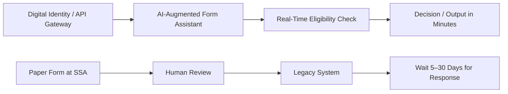

# 🛰️ Case Study: DoD vs. HHS – Digital Workflow Modernization

**Why the Department of Defense Runs on AI While the DMV Still Runs on Paper**

---

## 🧠 Overview

This case study compares the digital workflows of the **Department of Defense (DoD)** with the **Department of Health and Human Services (HHS)** — and outlines how their practices could be adapted to modernize everyday services like the **Social Security Office** and **Department of Transportation (DMV)**.

We examine:

* Mission-driven vs. citizen-driven technology use
* AI, cloud, and low-code adoption
* What slows down civilian agencies
* How we can modernize front-facing services with DoD-inspired agility

---

## 🛰️ Section 1: DoD Digital Workflow Strategy

| Feature         | Department of Defense (DoD) Implementation                               |
| --------------- | ------------------------------------------------------------------------ |
| **Cloud**       | AWS GovCloud, Azure IL5, classified Kubernetes clusters                  |
| **AI/ML**       | Computer vision for drones, predictive maintenance, battlefield modeling |
| **Contracting** | OTAs (Other Transaction Agreements) used for rapid tech adoption         |
| **Culture**     | Experimentation-first, mission-focused, "fail fast" innovation cycles    |
| **Outcome**     | Rapid tech deployment, automated decisions, reduced human intervention   |

---

## 🏛️ Section 2: HHS and Civilian Agency Challenges

| Feature         | HHS / SSA / DMV Reality                                                |
| --------------- | ---------------------------------------------------------------------- |
| **Tech Stack**  | COBOL, .NET 2.0, Oracle 11g still in production                        |
| **AI/ML**       | Pilot projects in fraud detection, limited NLP for form automation     |
| **Contracting** | Waterfall contracting cycles under FAR, often 3–5 years per update     |
| **Culture**     | Risk-averse, compliance-centric, low tolerance for experimentation     |
| **Outcome**     | Outdated UIs, long queues, PDF-based forms, multi-day turnaround times |

---

## 🧭 Visual Workflow Comparison

```mermaid
flowchart TD

  %% DoD Workflow
  A1[Mission Need]
  A2[Prototype (OTA)]
  A3[Cloud-Hosted AI Tool]
  A4[Automated Action / Decision]

  A1 --> A2
  A2 --> A3
  A3 --> A4

  %% HHS Workflow
  B1[Citizen Request]
  B2[Paper Form or Static PDF]
  B3[Manual Data Entry]
  B4[COBOL or Legacy Mainframe]
  B5[Approval Delays / Backlogs]

  B1 --> B2
  B2 --> B3
  B3 --> B4
  B4 --> B5

  %% Grouping for visual clarity
  subgraph DoD_Workflow [DoD Workflow]
    A1 --> A2 --> A3 --> A4
  end

  subgraph HHS_Workflow [HHS Workflow]
    B1 --> B2 --> B3 --> B4 --> B5
  end
```

---

## 🧰 Section 3: What Slows Down Social Security and DMV Offices

* Fragmented data (identity, eligibility, address not unified)
* No API-first or citizen-ID layer for services
* Manual paperwork + outdated mainframes
* Federal procurement delays
* Lack of performance incentives for real-time service improvement

---

## 🧠 Section 4: What Could Be Done (DoD-Inspired Solutions)

| Fix                          | DoD Model Equivalent                               |
| ---------------------------- | -------------------------------------------------- |
| Pre-cleared SaaS platforms   | FedRAMP-approved tools like Retool, Okta, GitHub   |
| Civic tech OTAs              | Like DIU / AFWERX rapid vendor pipelines           |
| AI Copilot for forms         | Turn static PDFs into GPT-augmented input flows    |
| Cloud-native queue analytics | Like DoD command dashboards with real-time metrics |
| Cross-agency "Digital Units" | Agile teams modeled after military readiness units |

---

## 📈 Visual: Fast vs. Slow Service Evolution



---

## 🔍 Summary

If we treated the DMV or SSA like a battlefield or mission ops center — with real-time monitoring, AI workflow automation, and agile pilot funding — we could:

* Cut average wait times from **2 hours to 2 minutes**
* Eliminate **backlogs** with Copilot + forms automation
* Provide **citizens with transparent, modern digital service**

The tools exist. What’s missing is a change in mindset, procurement agility, and cross-agency digital readiness.

---

> Written by [Erwin Maurice McDonald](https://github.com/emcdo411) as part of a larger digital modernization series
> Tools used: GitHub, Mermaid.js, AI prompt engineering, Microsoft MSSA Cloud Dev workflow

